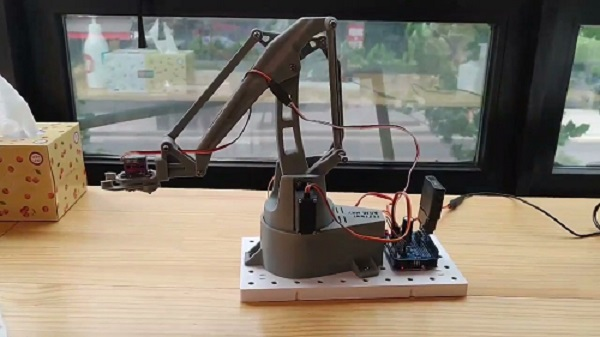

# Hell Arm MK2 Arduino PCA9685

### [Version 1.0-alpha](https://github.com/WeAreHellMaker/HellArm_MK2_Arduino_PCA9685) 

Here's an Arduino code to control the EEZYbotARM Mk1 & Mk2 robotic arm using a PS2 controller with servo motors.

## Contents

## Introduction

## Installation 

### Installation (arduino)

To install the arduino code it is as simple as uploading the sketch 'arduino\HellArm_MK2_Arduino_PCA9685' to the arduino microcontroller.
The easiest way to do this is using the arduino IDE, see instructions at: https://www.arduino.cc/en/Main/Software 

### Installing Libraries (arduino)

https://github.com/ArminJo/ServoEasing

The arduino software uses ArminJo's ServoEasing library so that the motions of the servo motors are smooth and not sudden 'jolts'. **Important:** You must uncomment the line `#define USE_PCA9685_SERVO_EXPANDER` in the file *ServoEasing.h* (as per the instructions for ServoEasing). The file *ServoEasing.h* can be found in the [Arduino libraries directory](https://www.arduino.cc/en/guide/libraries). 

https://github.com/madsci1016/Arduino-PS2X

This library is used to control a PS2 controller.

